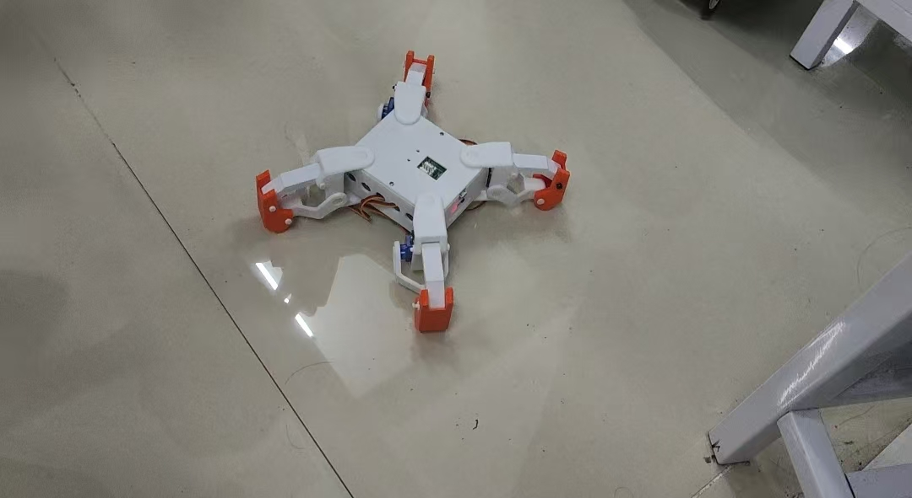
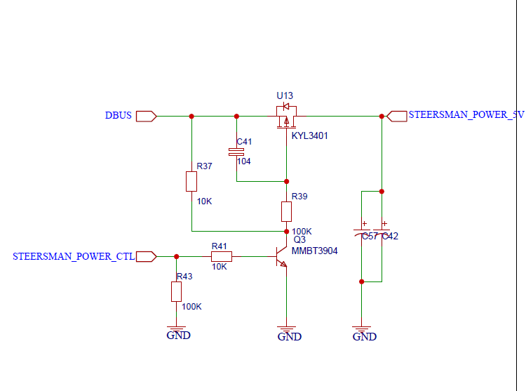
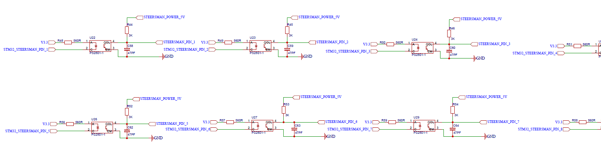
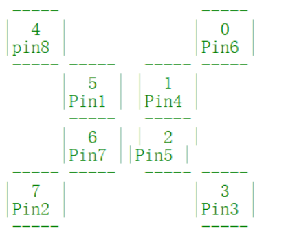
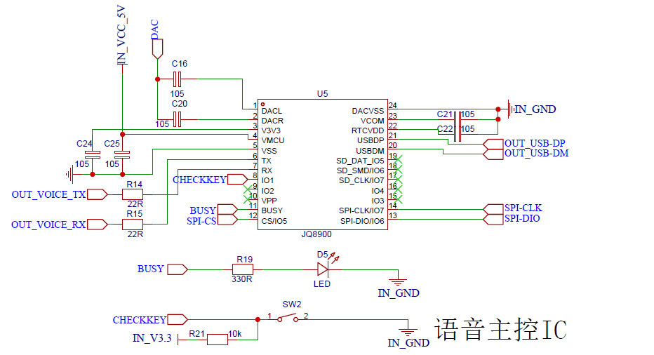
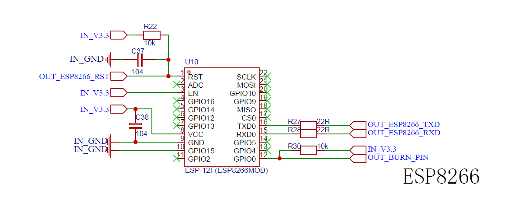

# 基于STM32的四足机器人

## 项目预览

## 项目职责
* 编写ESP8266**WIFI**模块代码
* 编写JQ8900-16P**语音播报**模块代码
* 编写SG90**舵机**驱动代码
***
## 关于舵机驱动控制
四足机器人有四个夹爪，其中每个夹爪采用两个SG90舵机，分别负责夹爪的水平和垂直移动，四个夹爪共8个SG90舵机

舵机的驱动原理是发送PWM信号，通过改变占空比驱动舵机的转动角度

PWM(Pulse Width Modulation)脉冲宽度调制，在具有惯性的系统中，可以通过一系列脉冲的宽度进行调制，来等效的获得所需模拟参量，常应用于电机控速领域

常用调制方法为通过定时器输出比较功能，通过设置PSC，ARR，CCR寄存器的值来调制一个频率可调，占空比受CCR控制的PWM波形

此处设计舵机控制电源电路，编写ADC驱动，用于测量电池电量情况，防止电池电压在小于5V情况下舵机运作出现异常

电路具体为PA15接通用推挽输出，当输出高电平时舵机通电可以运行，当输出低电平时舵机断电
### 舵机控制电路




编写定时器驱动，定时器输出比较配置PWM，舵机初始化配置如下：
- arm0---PB8---TIM4_CH3-----右前下
- arm1---PB9---TIM4_CH4-----右前上
- arm2---PB6---TIM4_CH1-----右后上
- arm3---PB7---TIM4_CH2-----右后下
- arm4---PA6---TIM3_CH1-----左前下
- arm5---PA7---TIM3_CH2-----无反应
- arm6---PA0---TIM5_CH1-----左后上
- arm7---PA1---TIM5_CH2-----左后下

在完成舵机初始化函数后，只需再编写舵机驱动函数即可编写机器人动作函数
```
#define PWM_MIX (500)
#define PWM_MAX (2500)
#define ANGLE_MAX (180.0f)
#define ANGLE_PWM ((PWM_MAX - PWM_MIX)/ANGLE_MAX)       //宏定义SG90舵机相关参数

void ArmCtrl_Angle (ArmDef ArmNum, float Angle)        //输入角度值控制对应的舵机角度
{
  uint16_t Compare;
	Compare = PWM_MIX + ANGLE_PWM*Angle - 1;          //舵机角度换算公式
	switch (ArmNum)                                   //选择对应舵机号控制角度
	{
		case ARM_RIGHT_BEFORE_L:			
			TIM_SetCompare3(TIM4, Compare);		
			break;
		case ARM_RIGHT_BEFORE_H:
			TIM_SetCompare4(TIM4, Compare);		
			break;
		case ARM_RIGHT_AFTER_H:
			TIM_SetCompare1(TIM4, Compare);		
			break;
		case ARM_RIGHT_AFTER_L:
			TIM_SetCompare2(TIM4, Compare);		
			break;
		case ARM_LEFT_BEFORE_L:
			TIM_SetCompare1(TIM3, Compare);	
			break;
		case ARM_LEFT_BEFORE_H:					
			TIM_SetCompare2(TIM3, Compare);		
			break;
		case ARM_LEFT_AFTER_H:
			TIM_SetCompare1(TIM5, Compare);		
			break;
		case ARM_LEFT_AFTER_L:
			TIM_SetCompare2(TIM5, Compare);	
			break;
		default:
			break;
	}
}
```
紧接着，完成功能函数四足机器人动作函数：
```
void Arm_Zero();         //初始动作
void Arm_Li();           //四足立起
void Arm_Jump();         //跳跃
void Arm_Push();         //俯卧撑
void Arm_Hello();        //打招呼
void Arm_Twisting();     //扭动
void Arm_Peristalsis();  //蠕动
void Arm_Left();         //左转
void Arm_Right();        //右转
void Arm_ss();           //四足立起
void Arm_Forward();      //前进
//注意，此处只做简单展示，详细代码请看控制代码
```
### 动作

***
## 关于语音播报模块
JQ8900-16P是一个集成了16位的MCU，以及一个专门针对音频解码的ADSP，采用硬解码的方式保证了系统的稳定性和音质

此芯片最大优势在于灵活更换SPI-Flash内的语音内容，跟拷贝U盘一样便捷，使产品研发和生产变得简单

通信协议方面选择**两线串口指定路径**播放，播放音频指定格式为```/文件夹名*/文件名*???```
### 语音播报电路


编写串口驱动，并且编写发送一个字节函数，之后编写语音播报函数，通信格式为起始码-指令类型-数据长度(n)-数据1-数据n-和校验
* 起始码：固定为AA，0xAA
* 指令类型：用来区分指令类型，0x08（代表使用路径和文件名指定播放音频）
* 数据长度：指令中的数据的字节数，strlen(数据)+1
* 数据：指令中的相关数据，当数据长度为 1 时,表示只有 CMD,没有数据位，指令类型是0x08时，这跟数据代表的是音频的路径和名字
* 和检验：为之前所有字节之和的低 8 位,即起始码到数据相加后取低 8 位，需要发送校验数据给到语音播报模块
```
void Serial_SendByte(uint8_t x)          //设置串口发送字节函数
{
	USART_SendData(USART1, x);
	while(USART_GetFlagStatus(USART1, USART_FLAG_TXE) == RESET);  //等待，为空可发送数据
}

void Voice_play(uint8_t *yinpin)
{
	uint8_t cnt=0;             //定义和校验
	Serial_SendByte(0xAA);               //发送起始码
	cnt += 0xAA;
	Serial_SendByte(0x08);               //发送指令类型
	cnt += 0x08;
	Serial_SendByte(strlen(yinpin)+1);   //发送数据长度
	cnt += strlen(yinpin)+1;
	for(int i=0 ; i<strlen(yinpin) ; i++)    //发送数据
	{
		Serial_SendByte(yinpin[i]);      
		cnt += yinpin[i];
	}
	Serial_SendByte(cnt&0xFF);           //发送和校验
}
```
后将各动作的语音存在指定路径中：
```
const  char *voice_buff[] = {
	"00001",		//停止
	"00002",		//直行
	"00003",		//后退
	"00004",		//左转
	"00005",		//右转
	"00006",		//扭动
	"00007",		//蠕动
	"00008",		//跳动
	"00009",		//打招呼
	"00010"			//俯卧撑
};
```
同时，也可以对音量进行调节：
```
void Set_Song_Volume(unsigned char volume_num)          //定义音量大小函数
{
	char Play_song_volume[4]={0xAA,0x13,0x01,0x09};     //设置音量数组
	Play_song_volume[3] = volume_num;                   //音量值进行赋值
	Voice_SendData((u8*)Play_song_volume,sizeof(Play_song_volume));
}
```
注意，盘符定义，切换盘符后处于停止状态：USB:00 SD:01 FLASH:02 NO_DEVICE:FF
***
## 关于WIFI模块
WIFI技术是一种使用电信号在无线电波上进行数据传输的技术，通过建立局域网，让各类设备（手机、电脑、平板等）以无线的方式连接，实现设备之间的无线传输

ESP8266 是一个非常强大的 WIFI 模块，可以利用串口与单片机进行通讯，从而编程实现控制 ESP8266

ESP8266模块通常支持三种工作模式：
* STA：此模式下，该模块相当于一个用户，需要链接外部的WIFI（或自己的热点），通过链接的WIFI进行与其他设备的通信
* AP：此模式下，该模块相当于提供一个热点，创建一个小范围的局域网，凡是连接上的设备就能与其进行通信
* STA+AP：该模式为 STA 模式与 AP 模式共存的一种模式，模块既能连接至其他设备提供的无线网络，又能作为热点，供其他设备连接，以实现广域网与局域网的无缝切换
### WIFI电路

编写串口驱动，并编写串口中断服务函数，编写发送字符函数，发送字符串函数
完成之后，即可编写ESP8266发送指令函数：
```
uint8_t Esp8266_SendCmd(u8 *cmd,u8 *respond)     //发送命令且判断是否成功执行
{
	usart2_send_str(cmd);        //发送AT指令
	delay_ms(300);
	while(1)                     //判断此指令ESP8266是否成功执行
	{
		if(u2.flag == 1)         //判断数据是否结束完成
		{
			u2.flag = 0;
			if(strstr((const char *)u2.buff,(const char *)respond) != NULL)
				return 0;              //发送成功
			else
				return 1;              //发送失败
		}
	}

}
```
此处，我们采用AP工作模式，设置ESP8266为客户端模式，创建小范围局域网，与上位机联网

其中，连接软路由指令：```AT+CWJAP="WIFI账号名","WIFI密码"\r\n```

连接服务器指令：```AT+CIPSTART="TCP","192.168.31.207",8080\r\n```

电脑端：连接手机热点 查IP：控制台 win + R 输入cmd，在控制台中输入ipconfig，回车，在上位机软件中查找
```
uint8_t ESP8266_Init()      //WIFI初始化
{
	u8 ret = 0;
	Usart2_Init(115200);              //ESP8266默认波特率：115200
	usart2_send_str((uint8_t *)"+++");
	delay_ms(300);                    //退出透传模式
	usart2_send_str((uint8_t *)"AT\r\n"); 
	delay_ms(300);                    //随便发送AT指令以跳过错误
	usart2_send_str((uint8_t *)"AT+RESTORE\r\n");
	delay_ms(2000);                   //恢复出厂设置
	ret = Esp8266_SendCmd((u8 *)"AT+CWMODE=1\r\n",(uint8_t *)"OK");     //设置ESP8266为客户端模式
	if(ret != 0)
	{
		printf("ESP8266设置客户端模式失败\r\n");
		return 1;
	}
		printf("ESP8266设置客户端模式成功\r\n");
	ret = Esp8266_SendCmd((u8 *)"AT+CIPMODE=1\r\n",(uint8_t *)"OK");    //设置ESP8266为透传模式
	if(ret != 0)
	{
		printf("ESP8266设置透传模式失败\r\n");
		return 2;
	}
	printf("ESP8266设置透传模式成功\r\n");
	
	printf("ESP8266初始化成功\r\n");
	return 0;
}

uint8_t ESP8266_ConnectWifi(u8 *ssid,u8 *pwd)      //连接软路由  WIFI账号 WIFI密码
{
	uint8_t cnt = 0;
	uint8_t wifi_buff[150] = {0};         //字符串拼接                
	sprintf((char *)wifi_buff,"AT+CWJAP=\"%s\",\"%s\"\r\n",ssid,pwd);
	A:
	usart2_send_str((u8 *)wifi_buff);     //发送拼接好的指令
	while(1)
	{
		while(!u2.flag);          //等待数据接收完成
		u2.flag = 0;
		
		if(strstr((const char *)u2.buff,"OK") != NULL)      //WIFI连接成功
		{
			printf("WIFI连接成功!!!!\r\n");
			return 0;
		}
		if(strstr((const char *)u2.buff,"FAIL") != NULL)    //WIFI连接失败
		{
			printf("WIFI连接失败，正在第%d次重新连接....\r\n",++cnt);
			if(cnt == 3)
			{
				printf("WIFI连接失败!!!!!\r\n");
				return 1;
			}
			goto A;
		}	
	}	
}

uint8_t Esp8266_ConnectServer(u8 *ip,u8 *port)    //连接服务器 IP地址 端口号
{
	
	uint8_t cat[200]={0};
	uint8_t sever_cnt = 0;
	strcat((char *)cat,"AT+CIPSTART=\"TCP\",\"");
	strcat((char *)cat,(const char *)ip);
	strcat((char *)cat,"\",");
	strcat((char *)cat,(const char *)port);
	strcat((char *)cat,"\r\n");
	B:
	usart2_send_str(cat);  //发送拼接完成的指令
	
	while(1)
	{
		while(!u2.flag);//等待数据接收完成
		u2.flag = 0;

		if(strstr((const char *)u2.buff,"OK")!=NULL)
		{
			printf("连接服务器成功\r\n");
			usart2_send_str((u8 *)"AT+CIPSEND\r\n");//进入发送模式命令    >
			return 0;
		}
		if(strstr((const char *)u2.buff,"ERROR")!=NULL)
		{
			if(sever_cnt == 3)
			{
				printf("连接服务器失败\r\n");
				return 1;
			}
			printf("连接服务器失败，正在尝试第%d次重试\r\n",++sever_cnt);
			goto B;
		}	
	}		
}
```


***
***
后面会继续更新，请等待
